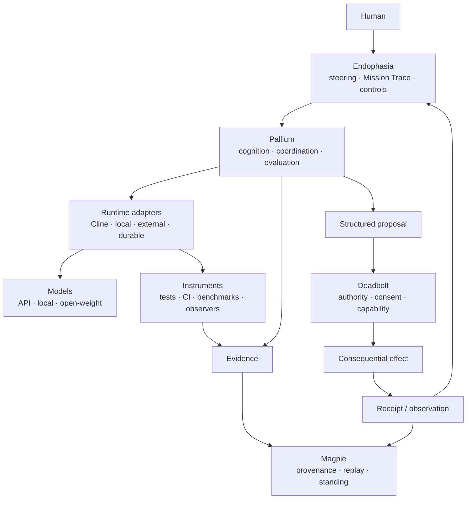

<a id="endophasia"></a>

<div align="center">

<p><sub>WORK &nbsp; / &nbsp; DREAM &nbsp; / &nbsp; OBSERVE &nbsp; / &nbsp; VERIFY</sub></p>

<h1>endophasia</h1>

<p><strong>Instrumented cognition for coding agents.</strong></p>

<p>
A Cline-derived workbench for making agent computation<br>
<strong>visible, steerable, comparable, and governable.</strong>
</p>

<p>
  <a href="#current-boundary"></a>
  <a href="https://github.com/cline/cline"></a>
  <a href="#runtime-model"></a>
  <a href="LICENSE"></a>
</p>

<p>
  <a href="#why-endophasia">Why</a> &nbsp; · &nbsp;
  <a href="#mission-trace">Mission Trace</a> &nbsp; · &nbsp;
  <a href="#work--dream">Work / Dream</a> &nbsp; · &nbsp;
  <a href="#architecture">Architecture</a> &nbsp; · &nbsp;
  <a href="#current-boundary">Status</a>
</p>

</div>

---

Most coding-agent interfaces show the prompt, the tools, and the answer.

The interesting system is increasingly everything around the model:

```text
context selection
reasoning budget
retrieval
verification
runtime state
peer review
action proposals
human steering
```

**Endophasia turns that hidden harness into an instrument panel.**

Not a chain-of-thought viewer. Not an agent swarm dashboard. A systems surface for seeing and steering what actually happened.

> [!IMPORTANT]
> **Endophasia is experimental.** The repository currently begins as a fork of [Cline](https://github.com/cline/cline). The controls, Mission Trace, Pallium integration, Magpie evidence surfaces, Deadbolt authority views, runtime adapters, and local white-box instrumentation described below are research direction unless explicitly marked implemented.

## Why Endophasia

A capable agent should be allowed to reason flexibly without making its surrounding system vague.

Endophasia is being shaped around five rules:

```text
preserve continuity
instrument reality
escalate cognition selectively
keep plans inspectable
keep authority outside the model
```

A short version:

```text
Endophasia exposes.
Pallium reasons.
Instruments measure.
Magpie remembers.
Deadbolt permits.
```

No line implies another.

## Mission Trace

The centre of Endophasia should be one **Mission Trace**: a real, observable timeline of work.

```text
08:14  mission started
08:15  primary inspected runtime/
08:18  hypothesis H1 created
08:21  test contradicted H1
08:24  independent challenge requested
        └─ checker found a counterexample
08:29  candidate patch
08:31  tests passed
08:33  benchmark regressed
08:36  candidate rejected
08:43  second candidate verified
```

The default model is continuity-first:

```text
task
 │
 ▼
PRIMARY AGENT
 │
 ├─ inspect
 ├─ reason
 ├─ edit
 ├─ test
 └─ retain orientation
      │
      │ when useful
      ▼
 independent peer
      │
   challenge
      │
      ▼
   PRIMARY AGENT
```

Peers are useful for **independent verification, adversarial challenge, orthogonal search, or genuine isolation**. They are not the default way to divide ordinary sequential thought.

> Parallelize search when it helps. Preserve continuity when it matters.

The trace should contain observable semantic events, not hidden private chain-of-thought:

```text
context.selected
hypothesis.created
hypothesis.rejected
tool.started
tool.finished
benchmark.recorded
verification.requested
verification.passed
peer.challenge.completed
proposal.created
approval.requested
```

If the UI says something happened, a real event should exist underneath it.

## WORK / DREAM

<table>
<tr>
<td width="50%" valign="top">
<sub>WORK</sub><br><br>
<strong>Convergent execution</strong><br><br>
One primary trajectory. Bounded exploration. Deterministic checks early. Selective review. Optimized for getting the task done without spending compute merely because it is available.
</td>
<td width="50%" valign="top">
<sub>DREAM</sub><br><br>
<strong>Exploratory cognition</strong><br><br>
Broader retrieval. More hypotheses retained. Counterfactuals. Stronger falsification. Optional independent challenge. White-box experiments where supported.
</td>
</tr>
</table>

Dream does not mean "spawn more agents."

```text
more cognition ≠ more authority
more branches  ≠ more truth
more agreement ≠ more permission
```

## Steering

Long-running agents need richer interaction than another chat message.

```text
STEER      change the active trajectory
QUEUE      deliver after current work settles
ANNOTATE   add context without replacing the objective
CHALLENGE  ask an independent checker
STOP       terminate future work
```

Those are different operations and should produce different runtime events.

## The control deck

| Control | Meaning |
| :--- | :--- |
| **Reasoning** | Provider-native or local reasoning budget. |
| **Epistemic Rigour** | Named verification and evidence policy. |
| **Explore** | Breadth of materially different alternatives considered. |
| **Verify** | Falsification, deterministic checks, and independent-review budget. |
| **Compute Appetite** | How readily more tokens, calls, tests, or branches are spent under uncertainty. |
| **Tool Initiative** | How readily the runtime inspects, retrieves, benchmarks, or proposes actions. |
| **Latent Deliberation** | White-box intervention where the runtime actually supports it. |
| **J-space** | Experimental latent-state observation for compatible local models. |

Controls should resolve to explicit runtime configuration.

Semantic policy should prefer named, versioned positions over meaningless precision:

```text
EXPLORATORY ─ BALANCED ─ RIGOROUS ─ ADVERSARIAL
```

A slider is useful only if the system can say what moving it changed.

## Instruments and evidence

If ordinary software can establish something mechanically, Endophasia should prefer that instrument before asking a model to judge itself.

```text
compiler
tests
benchmark
Git state
CI
runtime metrics
static analysis
```

A useful hierarchy is:

```text
deterministic observation
        ↓
derived measurement
        ↓
independent verification
        ↓
model interpretation
```

Evidence should also retain **how it was obtained**. An exact observation, sampled metric, derived claim, historical record, external source, and model report are not interchangeable.

Missing should remain missing rather than becoming a fabricated zero or guessed state.

## Plans are not effects

A model proposal should be inspectable before it becomes consequential.

```text
model intent
    │
    ▼
structured proposal
    │
    ▼
inspectable plan
    │
    ├─ operations
    ├─ dependencies
    ├─ bounds
    └─ required authority
    │
    ▼
review / policy
```

A valid plan is still only a proposal.

Consequential effects belong behind an explicit authority boundary:

```text
agent
  │ proposes
  ▼
plan
  │
  ▼
DEADBOLT
  ├─ typed route
  ├─ policy
  ├─ lease
  ├─ confirmation
  └─ receipt
       │
       ▼
real effect
```

## Runtime model

Endophasia begins with Cline, but Endophasia-specific semantics should not permanently depend on one harness.

```text
                    ENDOPHASIA
                        │
                  runtime contract
                        │
       ┌────────────────┼────────────────┐
       ▼                ▼                ▼
 Cline runtime      remote harness    durable backend
       │                │                │
     models           agents          workflows
     tools            machines        services
```

A runtime adapter needs surprisingly little conceptually:

```text
attach
invoke
observe
steer
queue
cancel
resume
identify workspace
report capability
```

Different substrates may provide more. Endophasia should not pretend they are identical.

## Architecture



### The boundary matters

| Layer | Owns | Must not silently become |
| :--- | :--- | :--- |
| **Endophasia** | Human steering, visualization, cognitive controls, traces. | Truth or execution authority. |
| **Pallium** | Cognitive continuity, selective coordination, evaluation. | Canonical epistemic history or permission. |
| **Runtime adapter** | Sessions, tools, provider/process lifecycle. | Root of trust merely because it executes. |
| **Instruments** | Measurements and bounded observations. | General reasoning agents. |
| **Magpie** | Evidence, provenance, replayable epistemic history, standing. | General orchestration. |
| **Deadbolt** | Consequential-action authority and receipts. | Cognition or memory. |
| **Local latent layer** | White-box observation and intervention. | Proof that an interpretation is true. |

## J-space

J-space is the deliberately white-box edge of the project.

Where local runtimes expose compatible internal state, Endophasia may experiment with latent readouts and interventions.

```text
model state → instrumentation → projection → J-SPACE VIEW
```

The projection is a view, not the underlying representation itself. For API-only models, **UNAVAILABLE** is better than fake parity.

J-space is research instrumentation, not the foundation of the product.

## Design rules

- **Telemetry should be real.** Decorative agent activity is worse than no telemetry.
- **Continuity is valuable.** Do not create a handoff without a reason.
- **Mechanical evidence beats self-report.** Completion is a claim until something checks it.
- **Independent review should actually be independent.** Isolation is useful when it reduces anchoring.
- **Plans are not effects.** Proposal, approval, execution, and receipt are separate states.
- **Reasoning is not authority.** More compute never widens permission.
- **Capability-aware UI beats fake parity.** Different runtimes expose different surfaces.
- **A feature that cannot beat a simpler baseline stays experimental.**

## Current boundary

Endophasia currently starts from the live [Cline](https://github.com/cline/cline) codebase, inheriting its sessions, providers, tools, plugins, MCP support, CLI, desktop surfaces, checkpoints, and agent runtime infrastructure.

Those are upstream capabilities, not Endophasia inventions.

Endophasia-specific work is currently at the **identity / architecture foundation** stage.

Not yet complete as Endophasia features:

```text
Mission Trace
cognitive control deck
Work / Dream policies
runtime adapter boundary
steer / queue / challenge controls
deterministic instrument panel
selective peer-checker flow
Pallium telemetry
Magpie evidence view
Deadbolt action review
local latent instrumentation / J-space
```

This list is deliberately explicit so the README cannot be mistaken for a feature-complete release announcement.

## Roadmap

The preferred sequence is deliberately vertical:

```text
0  identity + upstream hygiene
       ↓
1  real Mission Trace from existing runtime events
       ↓
2  primary-agent continuity + steering
       ↓
3  deterministic verification / instrument surface
       ↓
4  selective independent checker
       ↓
5  Work / Dream + versioned cognitive policies
       ↓
6  structured proposal / action review
       ↓
7  Magpie evidence + Deadbolt authority seams
       ↓
8  additional runtime adapters
       ↓
9  local white-box / J-space research
```

The first important demonstration is not a swarm. It is one complete, legible loop:

```text
human task
   ↓
primary agent
   ↓
tools + instruments
   ↓
optional independent challenge
   ↓
evidence
   ↓
structured proposal
   ↓
authority review
   ↓
effect
   ↓
receipt
```

## Upstream

Endophasia is an independent experimental fork of [Cline](https://github.com/cline/cline).

The goal is to remain upstream-aware and keep Endophasia-specific semantics narrow enough to inspect, test, and replace independently.

```text
Cline
  │
  ├─ providers
  ├─ sessions
  ├─ tools
  └─ application infrastructure
        │
        ▼
   Endophasia
        │
   cognition · evidence · governance surfaces
```

## Name

*Endophasia* refers to inner speech: language carried internally rather than spoken aloud.

The project is interested in what happens around a model before the final answer appears — but only where those processes can be exposed honestly.

The interface should illuminate computation.

It should not invent cognition for decoration.

---

**Status:** experimental · research-first · upstream-aware
