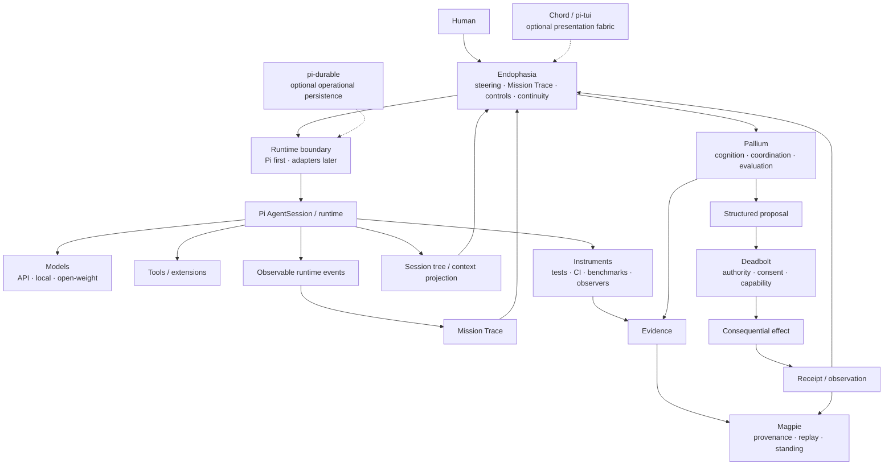

<a id="endophasia"></a>

<div align="center">

<p><sub>WORK &nbsp; / &nbsp; DREAM &nbsp; / &nbsp; OBSERVE &nbsp; / &nbsp; VERIFY</sub></p>

<h1>endophasia</h1>

<p><strong>Instrumented cognition for coding agents.</strong></p>

<p>
A Pi-based research workbench for making agent computation<br>
<strong>visible, steerable, comparable, and governable.</strong>
</p>

<p>
  <a href="#current-boundary"></a>
  <a href="https://github.com/earendil-works/pi"></a>
  <a href="#runtime-model"></a>
  <a href="LICENSE"></a>
</p>

<p>
  <a href="#why-endophasia">Why</a> &nbsp; · &nbsp;
  <a href="#mission-trace">Mission Trace</a> &nbsp; · &nbsp;
  <a href="#continuity-and-context">Continuity</a> &nbsp; · &nbsp;
  <a href="#work--dream">Work / Dream</a> &nbsp; · &nbsp;
  <a href="#architecture">Architecture</a> &nbsp; · &nbsp;
  <a href="#current-boundary">Status</a>
</p>

</div>

---

Most coding-agent interfaces show the prompt, the tools, and the answer.

The interesting system is increasingly everything around the model:

```text
context selection
reasoning budget
retrieval
verification
runtime state
branching
peer review
action proposals
human steering
```

**Endophasia turns that hidden harness into an instrument panel.**

Not a chain-of-thought viewer. Not an agent swarm dashboard. A systems surface for seeing and steering what actually happened.

> [!IMPORTANT]
> **Endophasia is experimental.** The repository currently begins as a fork of [Pi](https://github.com/earendil-works/pi). Pi already provides a substantial agent/runtime substrate; the Endophasia controls, Mission Trace, Pallium integration, Magpie evidence surfaces, Deadbolt authority views, and local white-box instrumentation described below are research direction unless explicitly marked implemented.

## Why Endophasia

A capable agent should be allowed to reason flexibly without making its surrounding system vague.

Endophasia is being shaped around five rules:

```text
preserve continuity
instrument reality
escalate cognition selectively
keep plans inspectable
keep authority outside the model
```

A short version:

```text
Endophasia exposes.
Pallium reasons.
Instruments measure.
Magpie remembers.
Deadbolt permits.
```

No line implies another.

## Why Pi

Pi is a particularly useful substrate for Endophasia because its public surfaces already expose many of the distinctions the project wants to make visible rather than simulate.

Relevant upstream primitives include:

```text
AgentSession / AgentSessionRuntime
  ├─ prompt
  ├─ steer
  ├─ followUp
  ├─ abort
  ├─ event subscriptions
  ├─ model + thinking-level control
  ├─ persistent session trees
  ├─ compaction + branch summaries
  └─ session replacement / fork / resume

extensions
  ├─ tools
  ├─ lifecycle events
  ├─ commands
  ├─ providers
  ├─ resource loading
  └─ UI surfaces

supporting packages
  ├─ pi-tui        terminal presentation
  ├─ pi-telemetry  passive typed diagnostics
  ├─ Chord         services, facets, replicated state
  └─ pi-durable    operational conversation/task/document durability
```

These are **upstream Pi capabilities**, not Endophasia inventions.

Endophasia should use them where they fit and keep its own semantics narrow enough to inspect, test, and replace.

## Mission Trace

The centre of Endophasia should be one **Mission Trace**: a real, observable timeline of work.

```text
08:14  mission started
08:15  primary inspected runtime/
08:18  hypothesis H1 created
08:21  test contradicted H1
08:24  independent challenge requested
        └─ checker found a counterexample
08:29  candidate patch
08:31  tests passed
08:33  benchmark regressed
08:36  candidate rejected
08:43  second candidate verified
```

The default model is continuity-first:

```text
task
 │
 ▼
PRIMARY AGENT
 │
 ├─ inspect
 ├─ reason
 ├─ edit
 ├─ test
 └─ retain orientation
      │
      │ when useful
      ▼
 independent peer
      │
   challenge
      │
      ▼
PRIMARY AGENT
```

Peers are useful for **independent verification, adversarial challenge, orthogonal search, or genuine isolation**. They are not the default way to divide ordinary sequential thought.

> Parallelize search when it helps. Preserve continuity when it matters.

The trace should contain observable semantic events, not hidden private chain-of-thought:

```text
mission.started
turn.started
context.changed
tool.started
tool.finished
benchmark.recorded
verification.requested
verification.passed
peer.challenge.completed
proposal.created
approval.requested
mission.completed
```

Pi already exposes real lifecycle events for agent, turn, message, tool, queue, retry, compaction, and settlement activity. Endophasia should project only the semantics it can establish from those events.

If the UI says something happened, a real event should exist underneath it.

Missing should remain missing.

## Continuity and context

Pi makes continuity observable in ways a flat chat transcript does not.

Its session representation can preserve branching, compaction, model and thinking-level changes, context edits, labels, and custom records. That creates a useful distinction:

```text
RAW HISTORY
    │
    ├─ original entries
    ├─ alternate branches
    ├─ compactions
    ├─ context edits
    └─ runtime changes
         │
         ▼
ACTIVE CONTEXT PROJECTION
         │
         ▼
what the next model request actually sees
```

Endophasia should make that relationship legible.

A context view may eventually answer questions such as:

- Which branch is active?
- What material survived compaction?
- Which historical entries no longer contribute to current model context?
- What model, thinking level, tools, or prompt sections changed?
- Which observations are raw history and which are derived projections?

A projection is not the underlying history. A summary is not the original evidence. A branch is not a separate truth.

## WORK / DREAM

<table>
<tr>
<td width="50%" valign="top">
<sub>WORK</sub><br><br>
<strong>Convergent execution</strong><br><br>
One primary trajectory. Bounded exploration. Deterministic checks early. Selective review. Optimized for getting the task done without spending compute merely because it is available.
</td>
<td width="50%" valign="top">
<sub>DREAM</sub><br><br>
<strong>Exploratory cognition</strong><br><br>
Broader retrieval. More hypotheses retained. Counterfactuals. Stronger falsification. Optional independent challenge. White-box experiments where supported.
</td>
</tr>
</table>

Dream does not mean "spawn more agents."

```text
more cognition ≠ more authority
more branches  ≠ more truth
more agreement ≠ more permission
```

## Steering

Long-running agents need richer interaction than another chat message.

```text
STEER      change the active trajectory
QUEUE      deliver after current work settles
ANNOTATE   add context without replacing the objective
CHALLENGE  ask an independent checker
STOP       terminate future work
```

Pi already gives Endophasia two unusually useful native distinctions:

```text
steer()    → deliver after the current assistant turn and its tool calls,
             before the next model call

followUp() → deliver at a run finish boundary when no earlier
             conversational trigger remains
```

Endophasia should preserve those distinctions rather than flattening them into generic chat messages.

Steering Controls v0 now maps STEER to Pi's steer queue, QUEUE to its follow-up queue, and STOP to a durable abort request for the observed run. Receipts report acceptance, not consumption or terminal outcome. Pi currently also accepts steer and follow-up input while idle; later execution still follows Pi's queue rules.

ANNOTATE and CHALLENGE require their own explicit semantics if implemented.

## The control deck

| Control | Meaning |
| :--- | :--- |
| **Reasoning** | Provider-native or local reasoning / thinking budget. |
| **Epistemic Rigour** | Named verification and evidence policy. |
| **Explore** | Breadth of materially different alternatives considered. |
| **Verify** | Falsification, deterministic checks, and independent-review budget. |
| **Compute Appetite** | How readily more tokens, calls, tests, or branches are spent under uncertainty. |
| **Tool Initiative** | How readily the runtime inspects, retrieves, benchmarks, or proposes actions. |
| **Latent Deliberation** | White-box intervention where the runtime actually supports it. |
| **J-space** | Experimental latent-state observation for compatible local models. |

Controls should resolve to explicit runtime configuration.

Pi already provides concrete configuration surfaces for models, thinking levels, active tools, resources, prompt sections, queue behaviour, compaction, retries, and providers. Endophasia policies can compose those primitives, but should not pretend every control maps cleanly to every runtime.

Semantic policy should prefer named, versioned positions over meaningless precision:

```text
EXPLORATORY ─ BALANCED ─ RIGOROUS ─ ADVERSARIAL
```

A slider is useful only if the system can say what moving it changed.

## Instruments and evidence

If ordinary software can establish something mechanically, Endophasia should prefer that instrument before asking a model to judge itself.

```text
compiler
tests
benchmark
Git state
CI
runtime metrics
static analysis
```

A useful hierarchy is:

```text
deterministic observation
        ↓
derived measurement
        ↓
independent verification
        ↓
model interpretation
```

Evidence should retain **how it was obtained**. An exact observation, sampled metric, derived claim, historical record, external source, and model report are not interchangeable.

Pi's `pi-telemetry` package is useful here as a diagnostic substrate: its own contract explicitly treats telemetry as passive diagnostic data rather than business state. Endophasia should keep the same separation.

Mission Trace, telemetry, and epistemic evidence are related views, not one undifferentiated log.

## Plans are not effects

A model proposal should be inspectable before it becomes consequential.

```text
model intent
    │
    ▼
structured proposal
    │
    ▼
inspectable plan
    │
    ├─ operations
    ├─ dependencies
    ├─ bounds
    └─ required authority
    │
    ▼
review / policy
```

A valid plan is still only a proposal.

Consequential effects belong behind an explicit authority boundary:

```text
agent
  │ proposes
  ▼
plan
  │
  ▼
DEADBOLT
  ├─ typed route
  ├─ policy
  ├─ lease
  ├─ confirmation
  └─ receipt
       │
       ▼
real effect
```

This boundary matters especially on Pi.

Upstream Pi intentionally does **not** provide a built-in permission system restricting filesystem, process, network, or credential access. Extensions run with the permissions available to the Pi process unless an external sandbox or isolation mechanism constrains them.

An extension hook that blocks a tool call can be useful policy. It is not automatically the root of authority.

## Operational state is not epistemic memory

Pi also exposes richer operational persistence than Endophasia had to assume before.

`pi-durable` / Pico describes durable conversations, tasks, entries, submissions, and documents. Chord can project committed state to local or remote consumers.

Those primitives may be useful for:

```text
mission progress
task state
review documents
UI projections
branch-aware work state
restart continuity
```

They should not silently become Magpie.

```text
Pi / Pico
  operational continuity
  conversations
  tasks
  documents

Mission Trace
  normalized observable execution

Pallium
  cognition / coordination semantics

Magpie
  claims
  evidence
  provenance
  epistemic standing

Deadbolt
  authority
  permission
  effects
  receipts
```

Different histories answer different questions.

## Runtime model

Pi is the first reference runtime, not a permanent semantic dependency.

```text
                     ENDOPHASIA
                         │
                   runtime contract
                         │
          ┌──────────────┼───────────────┐
          ▼              ▼               ▼
      Pi runtime      remote harness   future adapter
          │              │               │
      sessions          agents          services
      tools             machines        workflows
      models
```

A runtime adapter needs surprisingly little conceptually:

```text
attach
invoke
observe
steer
queue
cancel
resume
identify workspace
report capability
```

Pi may provide substantially more than that. Endophasia should use capability discovery rather than pretending different substrates are identical.

## Chord and presentation surfaces

Pi's standalone **Chord** package creates an interesting path for Endophasia beyond one terminal process.

Chord provides typed services, facets, replicated state, lifecycle management, and a transport-independent remote-service boundary.

A future Endophasia deployment could use those primitives like this:

```text
                    ENDOPHASIA

                 shared typed services
                         │
              ┌──────────┼──────────┐
              ▼          ▼          ▼
          worker facet  TUI facet  desktop/web facet
              │
              ▼
          Pi runtime
```

The attraction is not distributed complexity for its own sake.

It is the possibility that a worker, TUI, and richer presentation client can consume the same explicit projections without each inventing its own state model.

This remains exploratory. Chord is infrastructure, not an Endophasia requirement.

## Architecture



### The boundary matters

| Layer | Owns | Must not silently become |
| :--- | :--- | :--- |
| **Endophasia** | Human steering, visualization, cognitive controls, traces, continuity views. | Truth or execution authority. |
| **Pallium** | Cognitive continuity, selective coordination, evaluation. | Canonical epistemic history or permission. |
| **Runtime adapter** | Sessions, tools, provider/process lifecycle. | Root of trust merely because it executes. |
| **Pi operational state** | Session history, branches, task/document state where adopted. | Epistemic standing. |
| **Instruments** | Measurements and bounded observations. | General reasoning agents. |
| **Magpie** | Evidence, provenance, replayable epistemic history, standing. | General orchestration. |
| **Deadbolt** | Consequential-action authority and receipts. | Cognition or memory. |
| **Local latent layer** | White-box observation and intervention. | Proof that an interpretation is true. |

## J-space

J-space is the deliberately white-box edge of the project.

Where local runtimes expose compatible internal state, Endophasia may experiment with latent readouts and interventions.

```text
model state → instrumentation → projection → J-SPACE VIEW
```

The projection is a view, not the underlying representation itself. For API-only models, **UNAVAILABLE** is better than fake parity.

Pi's provider and streaming extension surfaces may make it easier to connect experimental local runtimes, but provider events are not themselves latent-state access.

J-space is research instrumentation, not the foundation of the product.

## Design rules

- **Telemetry should be real.** Decorative agent activity is worse than no telemetry.
- **Continuity is valuable.** Do not create a handoff without a reason.
- **History and context are different.** A context projection must not rewrite what actually happened.
- **Mechanical evidence beats self-report.** Completion is a claim until something checks it.
- **Independent review should actually be independent.** Isolation is useful when it reduces anchoring.
- **Plans are not effects.** Proposal, approval, execution, and receipt are separate states.
- **Reasoning is not authority.** More compute never widens permission.
- **Operational state is not epistemic standing.** Persistence does not make a claim true.
- **Capability-aware UI beats fake parity.** Different runtimes expose different surfaces.
- **A feature that cannot beat a simpler baseline stays experimental.**

## Current boundary

Endophasia currently starts from the live [Pi](https://github.com/earendil-works/pi) codebase.

The fork inherits Pi's agent loop, coding-agent CLI, models/providers, tools, extensions, persistent session machinery, TUI, RPC mode, Chord, telemetry primitives, and other upstream infrastructure.

Those are upstream capabilities, not Endophasia inventions.

The active fork is currently at the **substrate migration / architecture foundation** stage. The previous Cline-based prototype established useful Mission Trace semantics. In `packages/endophasia`, the Pi fork implements Mission Trace v0 as a passive `AgentHarness.events` lifecycle projection, Continuity v0 as a read-only, lane-scoped projection of durable ancestry and Pi's compaction-bounded context-source window, and Steering Controls v0 as bounded STEER / QUEUE / STOP calls with payload-minimal receipts and state. These surfaces have no persistence or UI. The context-source window is not the final provider-visible prompt.

Not yet complete as Endophasia features in this fork:

```text
full session-wide branch inventory and exact provider-visible context inspection
cognitive control deck
Work / Dream policies
runtime adapter boundary
Endophasia-level annotate / challenge semantics
deterministic instrument panel
selective peer-checker flow
Pallium integration
Magpie evidence view
Deadbolt action review
Chord-backed multi-surface cockpit
local latent instrumentation / J-space
```

This list is deliberately explicit so the README cannot be mistaken for a feature-complete release announcement.

## Roadmap

The preferred sequence is deliberately vertical:

```text
0  identity + Pi upstream hygiene
     ↓
1  Mission Trace projection from Pi runtime events
     ↓
2  continuity + active-context inspector
     ↓
3  native steer / queue integration
     ↓
4  deterministic verification / instrument surface
     ↓
5  selective independent checker
     ↓
6  Work / Dream + versioned cognitive policies
     ↓
7  structured proposal / action review
     ↓
8  Magpie evidence + Deadbolt authority seams
     ↓
9  optional Chord / durable presentation and persistence experiments
     ↓
10 additional runtime adapters
     ↓
11 local white-box / J-space research
```

The first important demonstration is not a swarm. It is one complete, legible loop:

```text
human task
   ↓
primary agent
   ↓
tools + instruments
   ↓
optional independent challenge
   ↓
evidence
   ↓
structured proposal
   ↓
authority review
   ↓
effect
   ↓
receipt
```

Before that full loop, the immediate Pi milestone is smaller:

```text
Pi task
  ↓
real runtime events
  ↓
Mission Trace
  ↓
continuity / context view
  ↓
human steer or queue
```

## Upstream

Endophasia is an independent experimental fork of [Pi](https://github.com/earendil-works/pi).

The intent is to stay close enough to upstream that Pi remains recognizable and updateable. Endophasia-specific semantics should prefer narrow packages, projections, adapters, and extensions over invasive changes to the underlying agent loop.

```text
Pi
 │
 ├─ agent runtime
 ├─ providers
 ├─ sessions
 ├─ tools / extensions
 ├─ TUI / RPC
 ├─ Chord
 └─ durable / telemetry primitives
        │
        ▼
   Endophasia
        │
        ├─ Mission Trace
        ├─ continuity views
        ├─ cognitive controls
        ├─ evidence surfaces
        └─ governance surfaces
```

For upstream Pi usage, development, package documentation, and contribution rules, see:

- [Pi repository](https://github.com/earendil-works/pi)
- [Pi documentation](https://pi.dev/docs/latest)
- [Pi SDK](https://pi.dev/docs/latest/sdk)
- [Pi extensions](https://pi.dev/docs/latest/extensions)
- [local `AGENTS.md`](AGENTS.md) for the inherited repository development rules

Unless Endophasia explicitly changes a package contract, upstream Pi documentation remains the reference for that package.

## Name

*Endophasia* refers to inner speech: language carried internally rather than spoken aloud.

The project is interested in what happens around a model before the final answer appears — but only where those processes can be exposed honestly.

The interface should illuminate computation.

It should not invent cognition for decoration.

---

**Status:** experimental · research-first · Pi-based · upstream-aware
