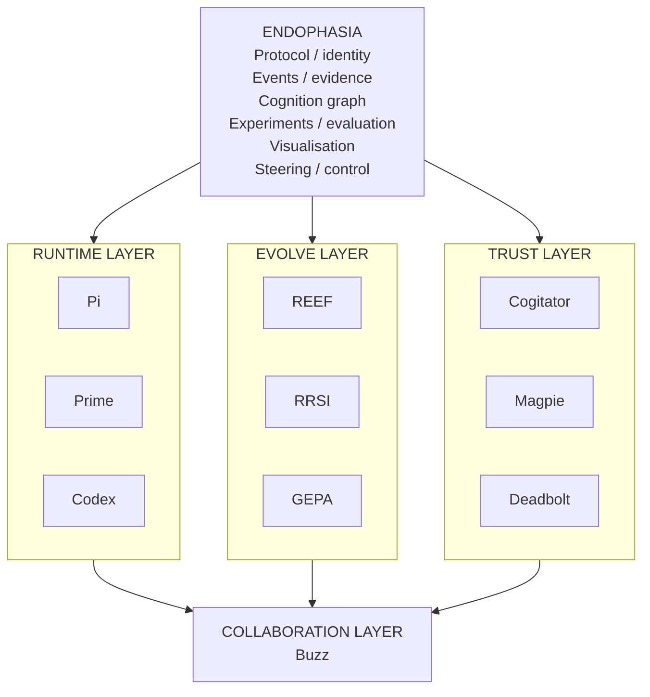

# Endophasia

**Instrumented cognition for coding agents and evolving AI systems.**

Observe and steer runtimes, represent cognition as evidence-bearing state, run controlled evolution experiments, and keep **evidence separate from authority**.

Endophasia is intended to be a **local-first, runtime-neutral cognition and experiment layer**. It is not another monolithic agent framework, not a replacement for Pi/Prime/REEF, and not an "open-source Foundry".

The central idea is simple:

> **Execution, evidence, epistemics, evolution, authority, and collaboration are different things. Endophasia connects them without silently collapsing them together.**

---

## Why Endophasia exists

AI systems increasingly consist of more than a model:

- prompts and context policy
- control flow and orchestration
- tools and permissions
- memory and skills
- sub-agents
- evaluation and feedback loops
- evolving harnesses
- model/runtime configuration
- human intervention
- external effects

When all of these are treated as one opaque "agent", it becomes difficult to answer basic questions:

- What actually happened?
- What did the runtime merely report?
- Which context produced this decision?
- What evidence supports this conclusion?
- What changed between two runs?
- Did an experiment improve the system or merely fit its benchmark?
- Which version of a harness produced a result?
- Is a candidate allowed to replace the current system?
- Which parts of a visualization are real runtime state, and which are presentation?
- Which actions were proposed, blocked, or actually executed?

Endophasia exists to make those distinctions explicit and inspectable.

---

## The architectural thesis

Endophasia should be a **substrate**, not the owner of every subsystem.

```mermaid
flowchart TB
    E["ENDOPHASIA<br/>Protocol / identity<br/>Events / evidence<br/>Cognition graph<br/>Experiments / evaluation<br/>Visualisation<br/>Steering / control"]

    subgraph R["RUNTIME LAYER"]
        Pi["Pi"]
        Prime["Prime"]
        Codex["Codex"]
    end

    subgraph V["EVOLVE LAYER"]
        Reef["REEF"]
        RRSI["RRSI"]
        GEPA["GEPA"]
    end

    subgraph T["TRUST LAYER"]
        Cog["Cogitator"]
        Mag["Magpie"]
        Dead["Deadbolt"]
    end

    Buzz["COLLABORATION LAYER<br/>Buzz"]

    E --> R
    E --> V
    E --> T
    R --> Buzz
    V --> Buzz
    T --> Buzz
```

The projects remain independent.

Endophasia provides the contracts and projections that let them compose.

---

# Core boundaries

## Runtime

A runtime executes the agent loop.

Examples:

- Pi
- Prime
- Codex
- future agent runtimes

Endophasia observes runtimes through explicit adapters and capability contracts.

A runtime adapter must not silently turn a runtime-specific feature into an Endophasia capability. Exact semantic compatibility requires evidence.

**Pi is the current reference runtime.**

Prime is primarily a research/EVOLVE subject unless and until a future conformance study establishes an exact Endophasia capability.

---

## Experience and evidence

The event/evidence substrate answers:

> **What happened, what was observed, and what can be reproduced or checked?**

Endophasia should provide:

- append-oriented event streams
- stable event/object identifiers
- provenance
- experiment records
- candidate/version identities
- evaluation results
- resource accounting
- replay references
- evidence bundles
- optional integrity/witness attachments

The event stream should be rich enough to support replay, graph construction, evaluation, and visualisation without forcing any of those systems to become the source of truth for the others.

---

## Cognition graph

Cognition is represented as a typed graph over observable state.

Useful object types include:

- Session
- Run
- Turn
- Context
- Thought or deliberation record (only when the runtime actually exposes one)
- Observation
- Claim
- Hypothesis
- Decision
- ToolCall
- ToolResult
- ModelCall
- ModelResponse
- Artifact
- Candidate
- Evaluation
- Experiment
- VisualizationState

Useful relationships include:

- derived-from
- supports
- contradicts
- depends-on
- references
- causes
- tool-produced
- model-produced
- supersedes
- related-to

Graph traversal should be incremental and budgeted:

    root
      ↓
    frontier
      ↓
    batched expansion
      ↓
    dedupe / visited set
      ↓
    emit snapshot
      ↓
    continue until depth / node / edge / time budget

This is deliberately inspired by the useful parts of Palantir's typed object/relationship model and its incremental graph-loading work, but Endophasia should remain independent of Foundry/OSDK.

The graph is not "the truth". It is a structured projection of recorded state and relationships.

---

# DEVELOP and EVOLVE

These are two major operating modes for the project.

## DEVELOP

**Current-session cognition and control.**

DEVELOP asks:

- What is the runtime doing now?
- What turn/operation is active?
- What context was used?
- Which tools were requested?
- What happened?
- What did verification establish?
- What did the human steer?
- What is the current usage/resource state?
- What can be safely interrupted or changed?

The current Pi-backed Endophasia work already establishes this direction through runtime-neutral observation contracts, Mission Trace, continuity inspection, runtime metrics, operation outcomes, usage, steering, and the browser cockpit.

DEVELOP is about the current run.

## EVOLVE

**Candidate experiments and controlled improvement.**

EVOLVE covers:

- prompt/harness evolution
- skill and memory evolution
- tool and orchestration changes
- model selection
- model-weight updates
- agentic RL
- RSI-style adaptation
- automated experiment loops
- evaluation and held-out testing
- evidence and promotion gates

A candidate can be evaluated without becoming the live system.

The intended sequence is:

    observe
      ↓
    propose
      ↓
    isolate
      ↓
    evaluate
      ↓
    compare
      ↓
    admit
      ↓
    promote

Promotion is deliberately last.

A benchmark winner is not automatically a deployment decision.

---

# WORK and DREAM

WORK and DREAM are cognition policies, not runtimes.

## WORK

A bounded main trajectory:

- limited exploration
- explicit resource budgets
- deterministic checks early
- focused context
- conservative branching
- strong preference for useful, attributable changes

## DREAM

A broader research mode:

- more retained hypotheses
- counterfactual branches
- stronger falsification
- independent challenge
- wider search
- alternative trajectories
- white-box experiments when the model exposes the required state

The core invariants are:

    more cognition != more authority
    more branches  != more truth
    more agreement != more permission

Dream visualisation is not decorative.

The renderer should be driven by live, model/runtime-controlled semantic state. Nodes, edges, attention, clusters, camera intent, uncertainty, atmosphere, and other visual properties should be projections of actual observable cognition state.

Where the runtime/model does not expose a required signal, Endophasia must report that it is unavailable rather than invent it.

---

# The evolution layer

Endophasia should own the **experiment/evolution contracts**, not every evolution algorithm.

A useful boundary is:

    endophasia/evolution/
    ├── core/
    │   ├── candidate
    │   ├── mutation
    │   ├── experiment
    │   ├── evaluation
    │   ├── evidence
    │   └── promotion
    └── policies/
        ├── rrsi/
        ├── gepa/
        └── custom/

The common substrate should record:

- candidate identity
- parent candidate
- source revision
- environment revision
- evaluator revision
- hypothesis
- proposed diff
- expected effect
- observed effect
- cost delta
- trial-level results
- held-out results
- selection decision
- promotion state
- provenance

This lets different algorithms share the same evidence and experiment model.

---

# REEF

[REEF](https://github.com/Human-Agent-Society/reef) is an **adaptation/infrastructure provider**, not Endophasia itself.

REEF connects serving, experience collection, learning recipes, evaluation, artifact versioning, and release. It supports both model-weight and harness evolution.

Conceptually:

    Endophasia EVOLVE
           │
           ▼
     AdaptationProvider
           │
           ├── Reef
           ├── RRSI
           ├── GEPA
           └── future methods

Do not copy REEF's serving/training/release machinery into Endophasia merely because Endophasia can observe it.

Instead, build a REEF adapter that maps its:

- scenario
- receipt
- feedback
- candidate
- artifact
- release
- evaluation

into Endophasia's common experiment/evidence model.

This keeps REEF useful as an independently evolving project while making its runs inspectable through Endophasia.

---

# RRSI

[RRSI](https://github.com/google-research/rrsi) is best treated as an **evolution policy**.

Its most useful reusable ideas are:

- annealed edit budgets
- full edit history
- evidence-aware credit assignment
- untried-component exploration
- leakage screening
- noise-adjusted acceptance
- resource/cost-aware selection
- novelty
- pruning of unproductive components
- explicit domain guards

Those ideas fit naturally into Endophasia's evolution contracts.

The important abstraction is not "Endophasia implements RRSI". It is:

    Endophasia experiment
          │
          ├── candidate history
          ├── evidence ledger
          ├── evaluation
          └── promotion contract
                   │
                   ▼
            RRSI selection policy

That makes it possible to compare RRSI with other adaptation policies under the same experiment and evidence semantics.

---

# Evidence is not authority

This is a foundational Endophasia rule.

These are different statements:

    candidate c17 passed 43 / 50 trials

    candidate c17 produced result bundle X

    candidate c17 is supported under evaluation policy P

    candidate c17 may replace the current version

They must remain different records with different semantics.

A useful conceptual split is:

                 Experiment run
                       │
                       ▼
             Immutable result bundle
                       │
                ┌──────┴──────┐
                ▼             ▼
            Endophasia      integrity
              record        / witness
                │
           ┌────┴────┐
           ▼         ▼
       Epistemics  Authority
         Magpie    Deadbolt

---

# Cogitator

[Cogitator](https://github.com/noctem-o/cogitator) should provide an optional **integrity/witness boundary**.

Cogitator is deliberately narrow:

- tamper-evident run records
- canonical event encoding
- pre-call policy interception
- blocked/phantom operations
- deterministic replay
- witness roots
- verification

That maps beautifully onto Endophasia evidence bundles.

The intended relationship is:

    Runtime
       ↓
    Endophasia observation
       ↓
    Evidence bundle
       ├── ordinary provenance
       └── optional Cogitator witness
                        ↓
                   witness root

A witness root establishes integrity relative to the committed semantics and supplied root. It does not magically prove that the run occurred, that the producing machine was trustworthy, or that a nondeterministic model became reproducible.

Endophasia should preserve those distinctions.

---

# Magpie

[Magpie](https://github.com/noctem-o/magpie) should be the optional **epistemic/knowledge provider**.

Magpie's useful boundary is:

    historical record
         ↓
    verification / provenance
         ↓
    claims + evidence
         ↓
    explicit policy
         ↓
    governed standing

Endophasia should not use Magpie as its raw runtime event store.

Instead:

    Endophasia:
        What happened?
        What was evaluated?
        What evidence exists?

    Magpie:
        Given these exact inputs and an explicit policy,
        what conclusion follows?

Magpie is therefore a downstream interpretation/standing layer over selected evidence.

It should not silently convert an evaluation score into truth, promotion, or authority.

---

# Deadbolt

[Deadbolt](https://github.com/noctem-o/deadbolt) should provide the optional **authority/effect boundary**.

Its conceptual position is:

    model intent
        ↓
    structured proposal
        ↓
    review / evidence / policy
        ↓
    authority check
        ↓
    real effect
        ↓
    receipt

Deadbolt should decide whether a consequential action is authorised.

It should not decide what evidence means.

Endophasia should therefore expose a provider-neutral authority seam, allowing Deadbolt or another authority implementation to handle:

- leases/capabilities
- proposal validation
- policy checks
- transactions
- effectors
- rollback
- effect receipts

A proposal does not widen the model's permissions merely because the model proposed it.

---

# Prime

Prime is an important **research subject and experimental runtime**, but it should not be forced into the Endophasia core.

The existing Prime conformance work is intentionally conservative: transport/RPC support can exist without claiming that Prime implements an Endophasia runtime capability.

Keep:

    adapters/prime/
    ├── transport/
    ├── probes/
    ├── conformance/
    └── experiments/

Prime is particularly interesting for EVOLVE because its concepts include persistent REPL state, recursive agents, refinement, goals, budgets, quality gates, and detailed trajectory accounting.

Those should be studied as experimental mechanisms, not silently promoted into Endophasia's canonical semantics.

---

# Pi

Pi remains the **reference runtime adapter**.

Endophasia should stay upstream-aware without becoming permanently coupled to Pi internals.

The design target is:

    Pi
     ↓
    Pi adapter
     ↓
    Endophasia runtime-neutral contracts
     ↓
    Endophasia services

This means upstream Pi changes can be absorbed in one boundary instead of forcing the entire Endophasia architecture to chase the fork forever.

The standalone repository exists specifically to create that cleaner boundary.

---

# Codex and future runtimes

Codex is a future runtime candidate.

The correct progression is:

    transport ingress
          ↓
    conformance study
          ↓
    recorded evidence
          ↓
    capability admission

A similar process should apply to any future runtime.

Runtime-specific protocols are inputs to conformance work, not definitions of Endophasia itself.

---

# Buzz

[Buzz](https://github.com/noctem-o/buzz-prime) belongs primarily in the **collaboration/interface plane**.

Buzz already provides an event-oriented workspace where humans and agents can share channels, threads, repositories, workflows, approvals and audit history.

That makes Buzz an excellent external surface for Endophasia experiments:

                     Endophasia
                         │
                  experiment/event API
                         │
                        Buzz
              ┌──────────┼──────────┐
              │          │          │
            human      agent       repo

An experiment can become a room.

A candidate can become a thread.

A patch can sit beside its evaluation.

An approval can sit beside the evidence that motivated it.

But Buzz should not need to understand cognition semantics in order to transport or display Endophasia events.

---

# Model and inference layer

Endophasia should not become another model-serving stack.

Treat inference engines and model providers as replaceable lower-level dependencies:

    Endophasia
        │
        ▼
    ModelProvider / InferenceProvider
        ├── local OpenAI-compatible server
        ├── SGLang
        ├── vLLM
        ├── llama.cpp and similar runtimes
        └── hosted providers

The experiment/evaluation layer should record the model identity, runtime configuration, resource envelope and relevant revision so results remain attributable.

Model routing can later become its own provider abstraction:

    ModelPool
     ├── capabilities
     ├── context limits
     ├── latency
     ├── throughput
     ├── current load
     ├── memory requirements
     ├── cost
     └── reliability

Adaptive queueing, retries, health, and concurrency management can be inspired by systems such as Palantir Dialogue without making Dialogue or Palantir infrastructure an Endophasia dependency.

---

# Protocol and identity

The protocol is the most important long-lived contract.

A future protocol should define versioned, language-neutral representations for:

    Session
    Run
    Event
    Artifact
    Object
    Edge
    Experiment
    Candidate
    Evaluation
    Evidence
    Decision
    Proposal
    Receipt
    VisualizationState

Use stable, namespaced identifiers rather than ad-hoc local IDs.

Example shape:

    endo.session.*
    endo.run.*
    endo.event.*
    endo.node.*
    endo.edge.*
    endo.model.*
    endo.tool.*
    endo.experiment.*
    endo.candidate.*
    endo.evidence.*

The protocol should be usable from Rust, TypeScript, Python and other languages.

A schema/IR/code-generation approach may eventually be appropriate, inspired by systems such as Palantir Conjure, but the protocol should stabilise before code generation becomes a source of accidental complexity.

---

# Event model

Everything important should be observable as a structured event.

Examples:

    session.started
    turn.started
    context.loaded

    model.requested
    model.token
    model.response

    tool.requested
    tool.completed
    tool.failed
    tool.blocked

    thought.created
    claim.created
    claim.revised
    hypothesis.created
    decision.made

    evaluation.started
    evaluation.completed
    candidate.created
    candidate.accepted
    candidate.rejected
    promotion.requested
    promotion.committed

    visual.state.changed

    error.occurred
    session.completed

Not every runtime will emit every event.

Missing capability must be represented honestly.

The event model should distinguish:

- fact emitted by runtime
- interpretation derived by Endophasia
- hypothesis
- evaluation result
- policy conclusion
- authority decision

Those are not interchangeable.

---

# Replay

Replay should become a first-class feature.

The ideal workflow is:

    record
      ↓
    persist
      ↓
    replay
      ↓
    rebuild graph
      ↓
    rebuild visual state
      ↓
    compare against original

A replay should tell the user which layers were reproduced exactly, which were reconstructed, and which could not be reproduced.

Deterministic fixtures are useful for conformance. They must not be presented as proof that a real model/runtime behaves deterministically.

---

# Evaluation

Evaluation should not be a collection of opaque benchmark scores.

Store:

    candidate revision
    runtime identity
    model identity
    cognition policy
    environment identity/revision
    sandbox identity
    evaluator identity/revision
    grader identity/revision
    seed(s)
    trial count
    usage
    wall time
    raw results
    derived metrics
    result bundle digest
    selection policy
    promotion state

Distinguish:

- evolve-set
- held-out
- out-of-distribution
- live traffic
- simulated environment
- replay

A simulated result must say that it was simulated.

A result must identify the inputs that produced it.

Equal-looking outputs with different producing coordinates are not necessarily the same result.

---

# Visualisation architecture

Two presentation surfaces should share one cognition substrate.

                    Cognition state
                         │
                         ▼
                semantic visual state
                    │           │
                    ▼           ▼
              Engineering    Dream
                 renderer    renderer

## Engineering mode

Data-dense and explicit:

- session timeline
- event stream
- graph inspector
- claims/evidence panel
- candidate diffs
- experiment metrics
- token/cost usage
- latency
- runtime capabilities
- provenance
- policy decisions
- promotion status
- degraded/unavailable states

This can borrow interaction ideas from dense desktop-oriented UI systems such as Palantir Blueprint.

## Dream mode

A bespoke live renderer for the same state:

- graph topology
- attention fields
- active regions
- branching hypotheses
- uncertainty
- semantic clusters
- tool/model boundaries
- temporal motion
- camera intent
- model-controlled atmosphere

The visual layer should never invent cognition just to make the scene look interesting.

---

# Suggested repository shape

The exact names can evolve, but the boundaries should remain recognisable.

    endophasia/
    ├── protocol/
    │   ├── schema/
    │   ├── events/
    │   ├── objects/
    │   ├── graph/
    │   ├── experiments/
    │   ├── evidence/
    │   └── visualization/
    │
    ├── runtime/
    │   ├── contracts/
    │   ├── observation/
    │   ├── control/
    │   └── profiles/
    │
    ├── events/
    │   ├── ingest/
    │   ├── stream/
    │   ├── replay/
    │   └── reducers/
    │
    ├── graph/
    │   ├── store/
    │   ├── traversal/
    │   ├── projections/
    │   └── subscriptions/
    │
    ├── experiments/
    │   ├── scenarios/
    │   ├── candidates/
    │   ├── evaluation/
    │   ├── comparison/
    │   └── promotion/
    │
    ├── evolution/
    │   ├── core/
    │   ├── policies/
    │   │   ├── rrsi/
    │   │   └── gepa/
    │   └── providers/
    │
    ├── evidence/
    │   ├── provenance/
    │   ├── bundles/
    │   ├── verification/
    │   └── witnesses/
    │
    ├── epistemics/
    │   ├── claims/
    │   ├── evidence/
    │   └── standing/
    │
    ├── authority/
    │   ├── proposals/
    │   ├── policies/
    │   └── providers/
    │
    ├── visualization/
    │   ├── semantic-state/
    │   ├── engineering/
    │   └── dream/
    │
    ├── adapters/
    │   ├── pi/
    │   ├── prime/
    │   ├── codex/
    │   ├── reef/
    │   ├── cogitator/
    │   ├── magpie/
    │   ├── deadbolt/
    │   └── buzz/
    │
    ├── models/
    │   ├── provider/
    │   ├── pool/
    │   └── telemetry/
    │
    ├── storage/
    ├── cli/
    ├── cockpit/
    ├── docs/
    └── tests/

The most important rule is that the core contracts do not import concrete providers.

---

# Dependency direction

Keep the architecture roughly one-way:

    protocol
       ↑
    contracts
       ↑
    core services
       ↑
    adapters / providers
       ↑
    applications / surfaces

In code:

    shared contracts
          ↓
    Endophasia services
          ↓
    Pi / Prime / REEF / RRSI / Cogitator / Magpie / Deadbolt / Buzz adapters

Concrete integrations should implement interfaces rather than leaking their types throughout the system.

This is especially important for:

- Pi upstream changes
- experimental Prime features
- optional REEF/RRSI installations
- local model backends
- provider-specific reasoning APIs
- future Codex support

---

# Palantir-derived architectural lessons

The useful lessons from Palantir's public projects are architectural, not a mandate to reproduce Foundry.

### Conjure

Use a canonical protocol/IR to keep multi-language clients and services aligned.

### Resource Identifier

Use stable, namespaced identities for cross-system objects.

### Dialogue

Treat orchestration as a systems problem:

- queueing
- concurrency limits
- retries
- node/provider selection
- health
- metrics
- tracing

### OSDK

Treat object relationships, graph traversal, caching, invalidation and streaming as first-class concerns.

### Witchcraft

Keep operational observability structured and distinguish safe diagnostic metadata from sensitive payloads.

### Blueprint

Engineering UIs can be dense and powerful without becoming the cognition engine.

### Policy Bot / Bulldozer

Repository automation can be declarative and evidence-driven rather than ad-hoc.

### AIP examples

Feedback should become reusable evaluation evidence rather than disappearing into an application log.

None of these projects should become a required Endophasia dependency merely because the architectural idea is useful.

---

# Security and trust principles

Endophasia is intended to be unusually explicit about what it does and does not establish.

## Never silently upgrade semantics

A successful check proves the proposition that the check defines.

It does not automatically prove:

- truth
- provenance
- freshness
- global completeness
- independent origin
- model correctness
- machine integrity
- authority to act

## Fail toward explicit uncertainty

Prefer:

    UNAVAILABLE
    UNKNOWN
    NOT_EVALUATED
    SIMULATED
    REPLAY_ONLY
    INCONCLUSIVE

over silently filling gaps.

## Separate plans from effects

    intent
      ↓
    proposal
      ↓
    review
      ↓
    authority
      ↓
    effect
      ↓
    receipt

A plan is not an effect.

A model's confidence is not permission.

A benchmark result is not authority.

---

# Conformance lab

Endophasia should retain a reusable conformance framework for testing runtime claims.

A study should contain:

    subject
    version / revision
    scenario
    decoder
    predicate
    expected semantic meaning
    observed result
    classification
    evidence
    limitations

The result can legitimately be:

    EXACT
    QUALIFIED
    PARTIAL
    UNAVAILABLE
    MISMATCH

"Nothing matched exactly" is a useful scientific result.

This is especially important for Prime and future Codex/runtime integrations.

---

# Roadmap

The ordering matters because later layers depend on the earlier contracts.

## Phase 0 — Standalone boundary

Complete the migration from the current Pi fork into endophasia-standalone.

Goal:

- preserve the useful current behaviour
- keep Pi upstream-aware
- establish a clean project boundary
- stop treating Pi's internal architecture as Endophasia's architecture

---

## Phase 1 — Protocol + identity

Build:

- versioned protocol
- stable identifiers
- event/object schemas
- capability vocabulary
- experiment/evidence coordinate model

Do not over-generalise before a few real integrations prove the abstractions.

---

## Phase 2 — Event and evidence substrate

Build:

- structured event ingestion
- append-oriented event storage
- replay
- reducers
- provenance
- resource accounting
- result bundles

This is the foundation of everything else.

---

## Phase 3 — Cognition graph

Build:

- typed nodes/edges
- normalized object store
- incremental traversal
- subscriptions
- bounded graph expansion
- temporal projections

At this point Endophasia becomes more than a trace viewer.

---

## Phase 4 — Real visual cognition

Build:

- semantic visual state
- engineering cockpit
- live graph updates
- model/runtime-directed animation
- Dream mode renderer
- graceful unavailable-state rendering

Use one state model for both renderers.

---

## Phase 5 — Evaluation and Conformance Lab

Build:

- evaluation profiles
- environment profiles
- repeated trials
- held-out testing
- result coordinates
- conformance studies
- experiment bundles
- replay comparison

This turns Endophasia into a scientific instrument rather than just an interface.

---

## Phase 6 — Evolution substrate

Build:

- candidate model
- mutation records
- experiment lifecycle
- evidence ledger
- selection contracts
- promotion gates
- artifact/version semantics

The substrate should be algorithm-neutral.

---

## Phase 7 — RRSI + REEF providers

Add:

- RRSI policy provider
- REEF adaptation provider
- GEPA or other harness-evolution provider
- candidate/evidence mapping
- release/version integration

Endophasia becomes the observability and experiment layer around continually evolving agents.

---

## Phase 8 — Trust integrations

Add:

- Cogitator witness integration
- Magpie epistemic integration
- Deadbolt authority integration

Keep them optional and protocol-bound.

---

## Phase 9 — Runtime expansion

Add:

- Prime research adapter
- Codex conformance study
- additional runtimes

Runtime admission remains evidence-based.

---

## Phase 10 — Model/runtime orchestration

Add:

- ModelPool
- capability-aware routing
- adaptive concurrency
- queueing
- retries
- health
- performance/resource telemetry
- local-model integrations

---

## Phase 11 — Collaboration

Add Buzz integration:

- experiments as rooms
- candidate discussions
- evidence/receipt links
- approval flows
- repository/patch context
- human-in-the-loop steering

---

## Phase 12 — Operational substrate & integration

Build:

- frame log: length-prefixed, digest-sealed frames; torn tails truncate, digest mismatch seals, undecodable frames are refused — never repaired
- content-addressed artifact store
- durable event store with recovery classification
- durable evidence ledger with snapshots and replay
- thin operator CLI printing one canonical-JSON document per command
- neutral runtime ports with adapter factories
- provider contract and an OpenAI-compatible adapter over an injected transport
- model routing and concurrency policies with explicit bounds
- RRSI and GEPA policy seams
- immutability and strict-JSON hardening across the protocol
- integration harness: golden path, adversarial corruption, persisted end-to-end

The system becomes operable: state is persisted, verified, and re-derived without trusting memory.

---

# Non-goals

Endophasia is not intended to become:

- a general-purpose agent framework
- a replacement for Pi
- a replacement for REEF
- an implementation of every RSI algorithm
- a model-serving engine
- a general database
- a general-purpose knowledge/truth engine
- a permission system by itself
- a compliance product
- an "open-source Foundry"
- a visualisation layer that fabricates hidden reasoning
- a system that treats benchmark scores as authority

Those concerns may be integrated, observed, or adapted through explicit boundaries.

They should not be collapsed into the core.

---

# Current design vocabulary

Keep these distinctions sharp:

    DEVELOP
      current-session cognition and control

    EVOLVE
      candidate experiments and system improvement

    WORK
      bounded cognition policy

    DREAM
      broad experimental cognition policy

    RUNTIME
      the thing executing the agent

    MODEL
      the thing providing inference capability

    ENVIRONMENT
      the thing defining the task/world in which the agent operates

    EVALUATION
      the procedure that measures a candidate

    ADAPTATION
      the procedure that changes a candidate

    EVIDENCE
      recorded material that can support a proposition

    EPISTEMICS
      explicit policy over evidence and claims

    AUTHORITY
      permission for consequential effects

    VISUALISATION
      projection of observable semantic state

    COLLABORATION
      humans and agents coordinating around the system

---

# Guiding sentence

The project should continuously be able to answer:

> **What happened, what supports that account, what remains uncertain, what changed, and who or what is actually allowed to make the next change?**

That is the architecture.

---

## Reference projects

- Pi / earendil-works/pi — https://github.com/earendil-works/pi
- REEF — https://github.com/Human-Agent-Society/reef
- RRSI — https://github.com/google-research/rrsi
- Cogitator — https://github.com/noctem-o/cogitator
- Magpie — https://github.com/noctem-o/magpie
- Deadbolt — https://github.com/noctem-o/deadbolt
- Buzz — https://github.com/noctem-o/buzz-prime

External architectural references:

- Palantir Conjure — https://github.com/palantir/conjure
- Palantir Resource Identifier — https://github.com/palantir/resource-identifier
- Palantir Dialogue — https://github.com/palantir/dialogue
- Palantir OSDK TypeScript — https://github.com/palantir/osdk-ts
- Palantir Blueprint — https://github.com/palantir/blueprint

---

## Status

endophasia-standalone is the clean architectural home for the next stage of Endophasia.

The implementation should evolve from the contracts outward, rather than letting any one runtime, benchmark, UI, evolution algorithm, or trust subsystem define the project.

**Observe first. Represent precisely. Evaluate explicitly. Evolve carefully. Authorise separately.**
